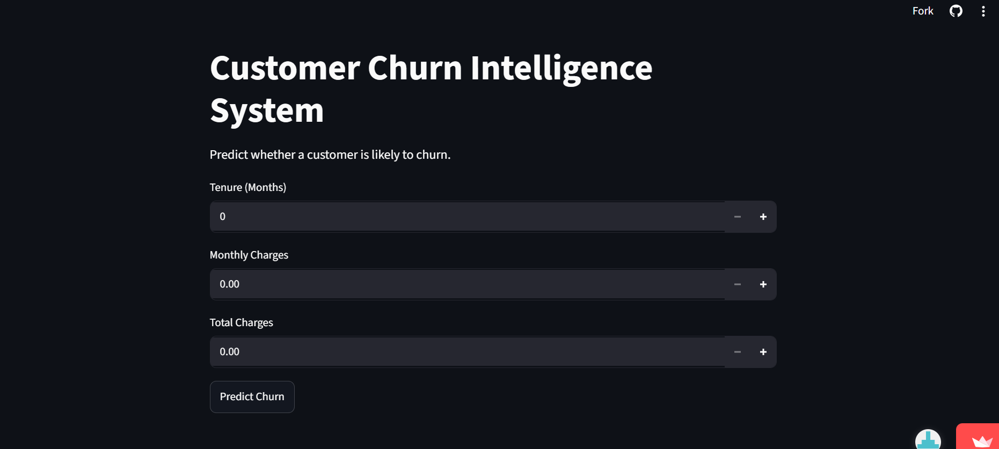
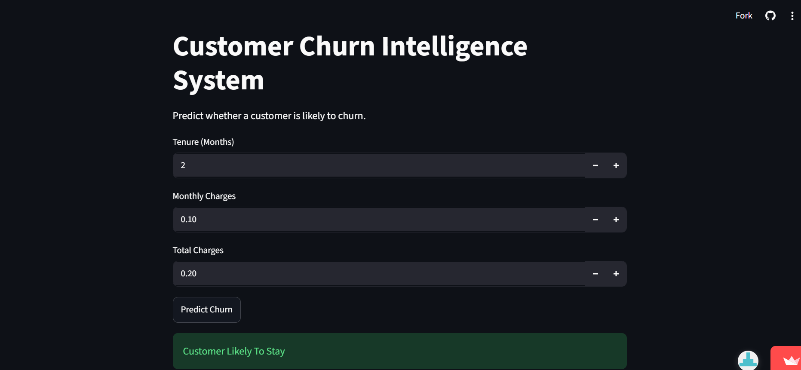
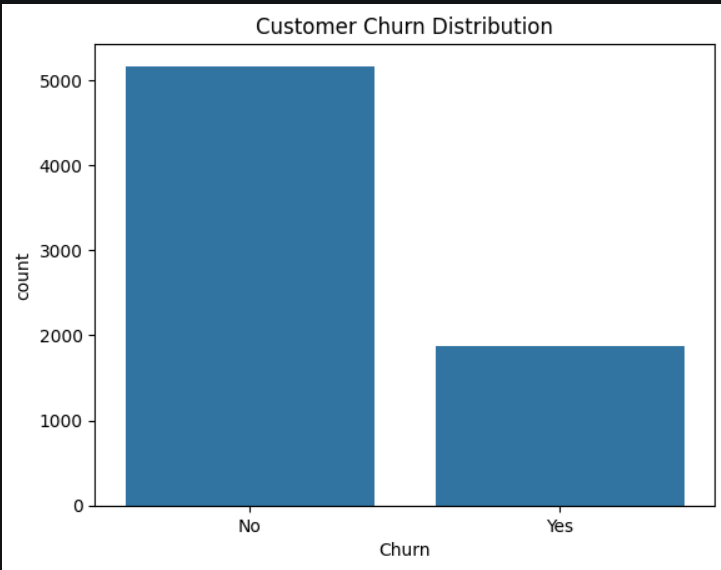
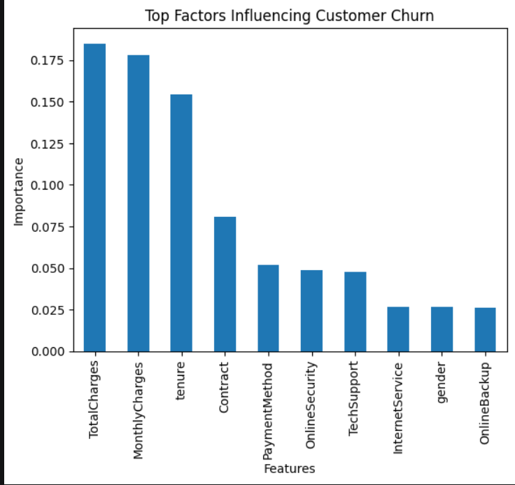

# 🚀 Customer Churn Intelligence System

## Synent Technologies Data Science Internship – Task 9

### 🌐 Live Demo

https://customer-churn-intelligence-system-b2xxawzmwq2qzpyvi88yhu.streamlit.app/

---

## 📌 Project Overview

Customer churn is one of the most critical challenges faced by businesses, especially in the telecommunications industry. Retaining existing customers is often more cost-effective than acquiring new ones.

The Customer Churn Intelligence System is an end-to-end Machine Learning project that predicts whether a customer is likely to leave a company based on customer demographics, account information, subscription details, and service usage patterns.

This project combines data preprocessing, exploratory data analysis, machine learning, model deployment, and a Streamlit web application to provide real-time churn predictions.

---

## 🎯 Problem Statement

Businesses lose significant revenue when customers discontinue services. Identifying customers who are at risk of churning enables organizations to take proactive measures and improve retention rates.

The objective of this project is to build an intelligent prediction system capable of identifying customers likely to churn using historical customer data.

---

## 📊 Dataset Details

### Dataset Name

IBM Telco Customer Churn Dataset

### Dataset Description

The dataset contains customer information from a telecommunications company and includes:

* Customer demographics
* Subscription details
* Service usage information
* Account information
* Billing information
* Churn status

### Key Features

* Gender
* Senior Citizen
* Partner
* Dependents
* Tenure
* Phone Service
* Internet Service
* Online Security
* Online Backup
* Device Protection
* Tech Support
* Streaming TV
* Streaming Movies
* Contract Type
* Payment Method
* Monthly Charges
* Total Charges

### Target Variable

**Churn**

* Yes → Customer leaves the company
* No → Customer remains with the company

---

## 🛠️ Technologies Used

* Python
* Pandas
* NumPy
* Matplotlib
* Seaborn
* Scikit-Learn
* Joblib
* Streamlit
* Google Colab

---

## 🔍 Project Workflow

### 1. Data Collection

* Imported customer churn dataset
* Loaded and inspected customer records

### 2. Data Cleaning

* Handled missing values
* Processed inconsistent records
* Prepared dataset for analysis

### 3. Exploratory Data Analysis (EDA)

* Analyzed customer behavior
* Studied churn distribution
* Identified important business trends

### 4. Feature Engineering

* Encoded categorical variables
* Selected relevant features
* Prepared model-ready dataset

### 5. Model Training

* Split data into training and testing sets
* Trained machine learning classification model
* Generated churn predictions

### 6. Model Evaluation

* Evaluated model performance
* Compared actual and predicted outcomes

### 7. Deployment

* Saved trained model using Pickle
* Developed interactive Streamlit application
* Enabled real-time churn prediction

---

## 📷 Project Screenshots

### Streamlit Application Interface



### Customer Churn Prediction Result



### Customer Churn Distribution Analysis



### Top Factors Influencing Customer Churn



---

## 📈 Key Insights

* Customer tenure significantly affects churn probability.
* Contract type has a strong influence on customer retention.
* Monthly charges impact customer churn behavior.
* Service subscriptions and support options contribute to retention.
* Machine learning can effectively identify high-risk customers.

---

## 🤖 Machine Learning Pipeline

1. Data Loading
2. Data Cleaning
3. Exploratory Data Analysis
4. Feature Engineering
5. Train-Test Split
6. Model Training
7. Model Evaluation
8. Model Serialization
9. Streamlit Deployment

---

## ✅ Results

Successfully developed a Customer Churn Intelligence System capable of predicting customer churn based on customer demographics, subscription information, and account details.

### Achievements

* Built a complete end-to-end machine learning solution.
* Performed data preprocessing and feature engineering.
* Conducted exploratory data analysis.
* Trained and evaluated a churn prediction model.
* Exported trained model for deployment.
* Developed a Streamlit web application for real-time predictions.
* Demonstrated practical business applications of predictive analytics.

---

## 📂 Repository Structure

```text
synent-task9-customerchurnintelligencesystem-sanjanamonteiro

├── Images/
│   ├── app_interface.png
│   ├── churn_distribution.png
│   ├── prediction_result.png
│   └── top_factors_influencing_churn.png
│
├── Customer_Churn_Project.ipynb
├── app.py
├── churn_model.pkl
├── feature_names.pkl
├── requirements.txt
└── README.md
```

---

## ▶️ How to Run

### Clone Repository

```bash
git clone https://github.com/sanjanamonteiro/synent-task9-customerchurnintelligencesystem-sanjanamonteiro.git
```

### Install Dependencies

```bash
pip install -r requirements.txt
```

### Run the Notebook

Open:

```text
Customer_Churn_Project.ipynb
```

and execute all cells.

### Launch the Streamlit App

```bash
streamlit run app.py
```

---

## 🎓 Internship Information

**Organization:** Synent Technologies
**Domain:** Data Science Internship
**Task:** Task 9 – End-to-End Data Science Project

---

## 👩‍💻 Author

**Sanjana Monteiro**

Data Science & Analytics Student
Synent Technologies Data Science Intern
